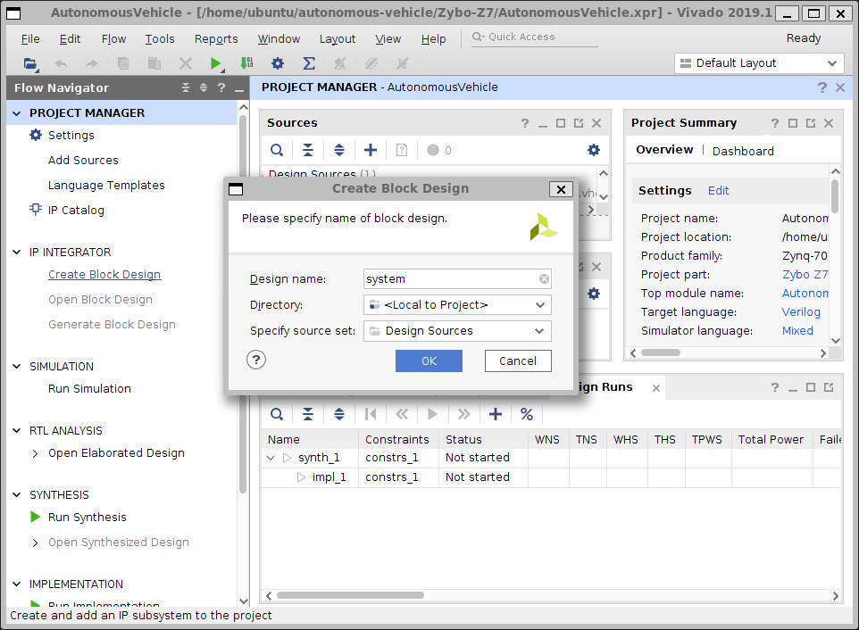
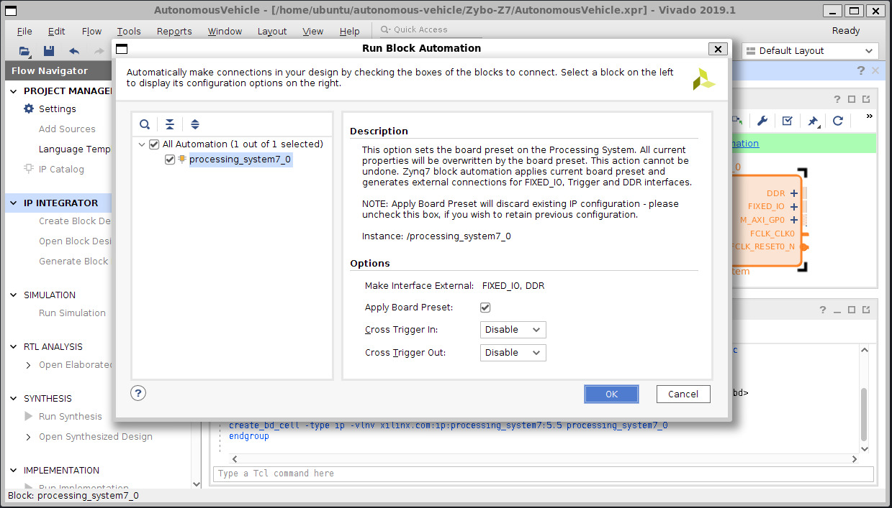
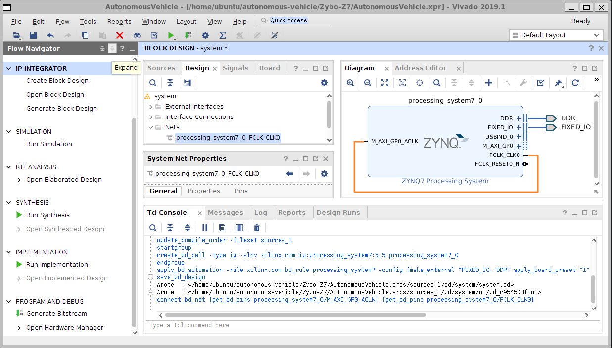

# Autonomous Vehicle

## 1. Install Xilinx Vivado SDK - 2025.1
- https://www.xilinx.com/support/download.html

## 2. Prepare for OpenCR Development

> ### References
> - https://emanual.robotis.com/docs/en/parts/controller/opencr10_jp/
> - https://qiita.com/basalte/items/e28d60ce0681c69ccee7

### 2.1. Import UDEV Rule
```
wget https://raw.githubusercontent.com/ROBOTIS-GIT/OpenCR/master/99-opencr-cdc.rules
```
```
sudo cp ./99-opencr-cdc.rules /etc/udev/rules.d/
```
```
sudo udevadm control --reload-rules
```
```
sudo udevadm trigger
```

### 2.2. Install Arduino IDE
```
sudo chmod 777 /opt
```
```
mkdir /opt/arduino-ide
```
```
cd /opt/arduino-ide
```
```
wget https://downloads.arduino.cc/arduino-ide/arduino-ide_2.3.6_Linux_64bit.zip
```
```
unzip arduino-ide_2.3.6_Linux_64bit.zip
```
```
sudo dpkg --add-architecture i386
```
```
sudo apt update && sudo apt install libasound2t64 libncurses5-dev libncurses5-dev:i386 libnss3-dev
```
```
/opt/arduino-ide/arduino-ide_2.3.6_Linux_64bit/arduino-ide
```

- Open `File` > `Preferences`
  - Edit `Additional boards manager URLs`
    - `https://raw.githubusercontent.com/ROBOTIS-GIT/OpenCR/master/arduino/opencr_release/package_opencr_index.json`

- Open `Tools` > `Board` > `Board Manager...`
  - Type `OpenCR` in `Filter your search` box
  - Inatall `OpenCR by ROBOTIS`

## 3. Zybo Z7 FPGA Image Recognition Development

> ### References
> - https://phys-higashi.com/73/#toc8
> - https://phys-higashi.com/114/#toc12
> - https://github.com/Digilent/Zybo-Z7-20-pcam-5c
> - https://fumimaker.net/entry/2020/02/06/002934
> - https://marsee101.blog.fc2.com/blog-entry-4027.html
> - https://xilinx.github.io/Vitis-Tutorials/master/docs-jp/docs-jp/Vitis_Platform_Creation/Design_Tutorials/02-Edge-AI-ZCU104/step1.html
> - https://cellspe.matrix.jp/zerofpga/vivado_xsa.html
> - https://zenn.dev/gnico/articles/2aef82b7adef44

### 3.1. Create New Project
- Project name: `AutonomousVehicle`
- Disable `Create project subdirectory`
- Select RTL Project
  - Enable `Do not specify sources at this time`
  - Disable `Project is an entensible Vitis platform`
- Download Board Data
  - `Boards` > `Zybo Z7-20`

### 3.2. Download Zybo Z7 XDC File
```
wget https://raw.githubusercontent.com/Digilent/digilent-xdc/refs/heads/master/Zybo-Z7-Master.xdc -O Zybo-Z7.xdc
```

### 3.3. Add Source
- Add XDC File
  - `Flow Navigator` > `PROJECT MANAGER` > `Add Sources` > `Add or create constraints`
- Add HDL Files
  - `Flow Navigator` > `PROJECT MANAGER` > `Add Sources` > `Add or create design sources`

### 3.4. Create Block Design
- `Flow Navigator` > `IP GENERATOR` > `Create Block Design`

<div align="center"></div>

- Add Processing System
  - `BLOCK DESIGN` > `Diagram` > `+ button to add IP` > `ZYNQ7 Processing System`
  - `BLOCK DESIGN` > `Diagram` > `Run Block Automation`
 
<div align="center"></div>

  - Right click Processing System Block > Customize Block
    -  MIO Configuration
      - Set UART1 `MIO 48 .. 49`
      - Set disable GPIO MIO50 pull-up
      - Set disable GPIO MIO51 pull-up
    - Clock Configuration
      - Set PL Fabric Clocks > FCLK_CLK0 100
  - `BLOCK DESIGN` > `Diagram` > `+ button to add IP` > `AXI GPIO`
  - `BLOCK DESIGN` > `Diagram` > `Run Connection Automation`
    - Enable S_AXI
  - `Processing System Block` > `FCLK_CLK0` > `Create port`
    - Set `Port name` to `ps_clk`
  - `Processing System Block` > `peripheral_aresetn[0:0]` > `Create port`
    - Set `Port name` to `ps_nrst`
  - `axi_gpio_0` > `Customize Block`
    - Enable `IP Configuration` > `Enable Dual Channel`
  - `axi_gpio_0` > `GPIO +` >  `gpio_io_i[31:0]` > `Create Port`
    - Set `Port name` to `ps_gpio_i0`
  - `axi_gpio_0` > `GPIO +` >  `gpio_io_o[31:0]` > `Create Port`
    - Set `Port name` to `ps_gpio_o0`
  - `axi_gpio_0` > `GPIO2 +` >  `gpio2_io_i[31:0]` > `Create Port`
    - Set `Port name` to `ps_gpio_i1`
  - `axi_gpio_0` > `GPIO2 +` >  `gpio2_io_o[31:0]` > `Create Port`
    - Set `Port name` to `ps_gpio_o1`
  - `BLOCK DESIGN` > `Platform Setup` > `AXI Port` 
    - Set `Enabled` of `M48`, `M49`, `M50` and `M51`
  - `BLOCK DESIGN` > `Platform Setup` > `Clock`
    - Set `Is Default` of `FCLK_CLK0`
  - `Diagram` > `Validate Design`
  - `Flow Navigator` > `IP Integrator` > `Generate Block Design` > `Generate`
  - Confirm `Flow Navigator` > `Project Manager` > `Sources` > `Design Sources` > `Zynq_PS`

<div align="center"></div>

### 3.5. Set Top-Level Entity
- `PROJECT MANAGER` > `Sources` > `Dedign Sources` > `AutonomousVehicle(AutonomousVehicle.vhd)`
  - Select `Set as Top`

### 3.6. Compilation
- `Flow Navigator` > `Synthesis` > `Run Synthesis`
- `Flow Navigator` > `Implementation` > `Run Implementation`
- `Flow Navigator` > `Program and Debug` > `Generate Bitstream`

### 3.7. Export Hardware
- `File` > `Export` > `Export platform` > `Hardware` > `Include bitstream/binary`
  - Select `Include bitstream`
  - XSA file name: `system`
